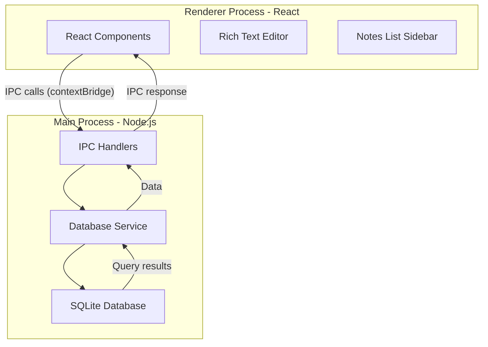
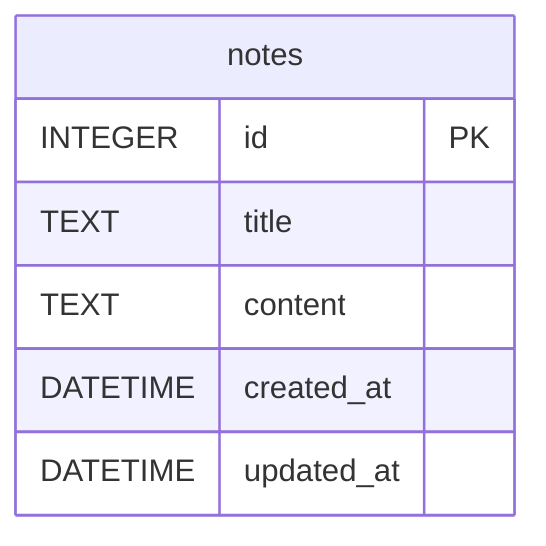

# Build Electron Notes App with SQLite

## Architecture Overview

## Database Schema

## Implementation Plan

### 1. Database Setup (SQLite with better-sqlite3)

**Install dependencies:**

- `better-sqlite3` - Fast SQLite3 bindings
- `@types/better-sqlite3` - TypeScript types

**Create database service** in [`src/main/database.ts`](src/main/database.ts):

- Initialize SQLite database in user data directory
- Create notes table with schema: id, title, content (rich text HTML), created_at, updated_at
- Implement CRUD operations: createNote, getNotes, getNote, updateNote, deleteNote
- Add error handling and logging

**Database location:** Use `app.getPath('userData')` to store `notes.db` in user's app data folder

### 2. IPC Communication Layer

**Update** [`src/main/preload.ts`](src/main/preload.ts):

- Expose safe database API through contextBridge
- Methods: createNote, getAllNotes, getNote, updateNote, deleteNote
- Use `ipcRenderer.invoke` for async database calls

**Update** [`src/main/main.ts`](src/main/main.ts):

- Import database service
- Register IPC handlers with `ipcMain.handle`
- Initialize database on app ready
- Map IPC calls to database service methods

**Create TypeScript types** in [`src/renderer/types.ts`](src/renderer/types.ts):

- Define Note interface (id, title, content, createdAt, updatedAt)
- Define window.electronAPI type for TypeScript autocomplete

### 3. Rich Text Editor Integration

**Install dependencies:**

- `@tiptap/react` - Rich text editor framework
- `@tiptap/starter-kit` - Basic editing extensions (bold, italic, lists, etc.)
- `@tiptap/extension-placeholder` - Placeholder text

**Create editor component** in [`src/renderer/components/Editor.tsx`](src/renderer/components/Editor.tsx):

- Setup Tiptap editor with StarterKit
- Configure toolbar with formatting buttons (bold, italic, headings, lists)
- Handle content changes with debounced auto-save
- Store content as HTML string

### 4. Modern UI Components

**Create component structure:**

- [`src/renderer/components/Sidebar.tsx`](src/renderer/components/Sidebar.tsx) - Notes list with search
- [`src/renderer/components/Editor.tsx`](src/renderer/components/Editor.tsx) - Rich text editor
- [`src/renderer/components/NoteItem.tsx`](src/renderer/components/NoteItem.tsx) - Individual note preview

**Update** [`src/renderer/App.tsx`](src/renderer/App.tsx):

- Two-column layout: Sidebar (30%) | Editor (70%)
- State management: selectedNoteId, notes array
- Load all notes on mount
- Handle note selection, creation, deletion
- Implement auto-save on content change (debounced 1 second)

**Styling approach:**

- Use CSS modules or styled-components for component styles
- Modern color scheme with good contrast
- Responsive sidebar that can collapse on smaller screens

### 5. Core Features

**Note Management:**

- Create new note button (creates untitled note, focuses editor)
- Delete note button with confirmation
- Display note list sorted by updated_at (newest first)
- Show note title and preview in sidebar
- Click note to load in editor

**Auto-save:**

- Debounce content changes (1 second delay)
- Update note title from first line of content
- Save to database automatically
- Show save status indicator

**Polish:**

- Display timestamps in user's local time zone
- Empty state when no notes exist
- Loading states during database operations
- Error handling with user-friendly messages
- Keyboard shortcuts (Ctrl/Cmd+N for new note)

## File Changes Summary

**New files to create:**

- `src/main/database.ts` - SQLite database service
- `src/renderer/types.ts` - TypeScript interfaces
- `src/renderer/components/Sidebar.tsx` - Notes list UI
- `src/renderer/components/Editor.tsx` - Rich text editor
- `src/renderer/components/NoteItem.tsx` - Note preview item

**Files to modify:**

- [`src/main/main.ts`](src/main/main.ts) - Add IPC handlers
- [`src/main/preload.ts`](src/main/preload.ts) - Expose database API
- [`src/renderer/App.tsx`](src/renderer/App.tsx) - Main app layout and logic
- [`src/renderer/App.css`](src/renderer/App.css) - Modern styling
- [`package.json`](package.json) - Add dependencies

## Learning Resources

### Electron + SQLite Tutorials:

1. **"Building a Desktop App with Electron and SQLite"** - LogRocket Blog

   - Covers better-sqlite3 setup and IPC patterns
   - https://blog.logrocket.com/electron-ipc-response-request-architecture-with-typescript/

2. **"Electron Security Best Practices"** - Electron Docs

   - contextBridge and IPC security (critical for your implementation)
   - https://www.electronjs.org/docs/latest/tutorial/security

3. **"better-sqlite3 Documentation"** - Official docs

   - API reference and best practices
   - https://github.com/WiseLibs/better-sqlite3/blob/master/docs/api.md

### Rich Text Editor (Tiptap):

4. **"Getting Started with Tiptap"** - Official Tiptap docs

   - React integration and StarterKit setup
   - https://tiptap.dev/docs/editor/getting-started/install/react

5. **"Building a Note-taking App with Tiptap"** - Tiptap Blog

   - Similar use case with auto-save patterns
   - https://tiptap.dev/blog

### Similar Projects:

6. **Notable** - Open source Electron notes app

   - GitHub: https://github.com/notable/notable
   - Shows production patterns for notes management

7. **Joplin** - Open source note-taking app

   - Uses SQLite for storage (more complex but good reference)
   - GitHub: https://github.com/laurent22/joplin

8. **Mini Note** - Simple Electron+React notes tutorial

   - Good starting point for basic architecture
   - Search: "electron react notes app tutorial" on Dev.to

### Database Management:

9. **"SQLite Tutorial for Beginners"** - SQLite Tutorial

   - SQL basics: CREATE, INSERT, UPDATE, DELETE, SELECT
   - https://www.sqlitetutorial.net/

10. **"Using SQLite in Electron"** - Medium article

    - Practical patterns for desktop apps
    - Search: "electron sqlite better-sqlite3 tutorial"

## Development Workflow

1. Install dependencies first
2. Build database layer and test with console.log
3. Setup IPC communication and verify with DevTools
4. Create basic UI layout without editor
5. Integrate Tiptap rich text editor
6. Add auto-save and polish features
7. Test thoroughly (create, edit, delete, restart app)

## Testing Tips

- Use DevTools (already configured in development mode)
- Check SQLite database file in userData directory
- Test app restart to ensure data persistence
- Test with many notes to verify performance
- Check for memory leaks with long editing sessions